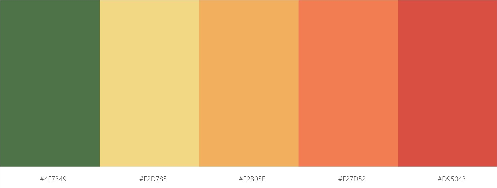

# 냉장고-식단 서비스

## Technical Stack

### 공통

- Git/github(https://github.com/sooyun429/brainstorming)
- Google Calendar

### Front

- Vue

### Back

- 

## Convention

### Commit message

- 기본 형식: [STATUS] MESSAGE | DATE | AUTHOR (ex. [ADD] Init vue project | 200712 | DH)

- STATUS 종류

  - ADD : 새 파일 작성 및 코드 추가
  - MOD : 기존 코드 수정
- DEL : 코드 및 파일 삭제

### Theme Color

## Scrum

(작성양식 예시: [back_feature] content (writer_date))

### TODO
- [Back] Spring boot + security (JWT 연동) (황인규_200707)
- [Back] Spring Issue해결, 다음 일정 의논 (황인규_200708)

### DONE
- [공통] README Scrum 양식 셋팅 (윤도희_200707)
- [Back] HeidiSQL 과 Spring boot 연동, swagger.ui api 200 확인 (황인규_200707) 
- [Back] Spring Security demo 실행(Issue. java.sql.SQLException, Heidi crashes on Windows 10 x64 build 17134 - Access violation) (황인규_200708)
- [Front] Vue 환경셋팅 (윤도희, 임우섭_200712)
- [공통] commit message 형식 지정 (회의_200712)
- [Front] Vue 프로젝트 생성 (임우섭_200712)
- [Front] Fix theme color (윤도희_200712)
- [Front] Router 추가_Signup, Login, Logout, Main (윤도희 _200712)
